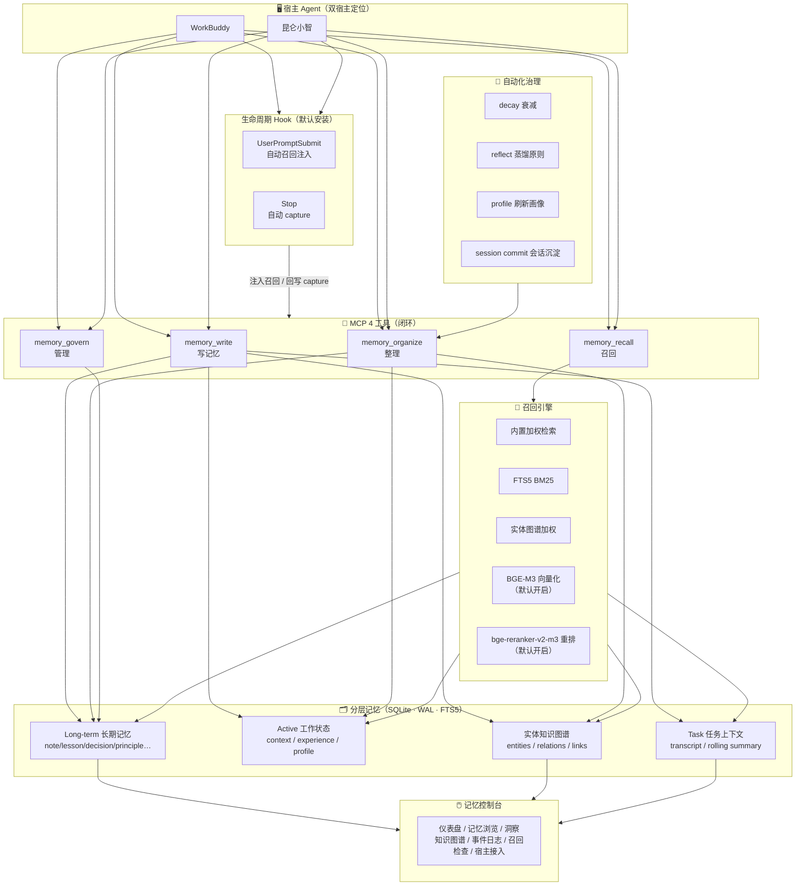

# 🍃 LeafMem

> 面向 AI Agent 的分层长期记忆引擎 —— 让 Agent 写得下、理得清、召得回，最终用记忆高效完成任务。

<p align="center">
  
  
  
</p>

很多记忆方案最终退化成"全部聊天记录"或"一份滚动摘要"，两者都会在规模上来后失真。LeafMem 选择不同的路：按**用途**分层——长期知识、当前工作状态、任务推进过程、实体关系各自独立存储，再由召回引擎按需拼装成一段可注入提示的上下文。整套系统服务于一个闭环：

> **Agent 写记忆 → Agent 整理记忆 → 人 + Agent 共同管理 → 召回记忆指导任务**

四层不是堆在一起，而是各司其职：长期记忆负责"记住"，active 负责"此刻在做什么"，任务上下文负责"这件事推进到哪了"，实体图谱负责"谁和什么有关系"。

---

## 📖 目录

1. [系统介绍](#-一系统介绍) —— 架构、四大 MCP 工具、分层记忆、自动化任务、纪律文件
2. [安装与升级](#-二安装与升级) —— 引导你的 Agent 完成安装 / 升级
3. [使用说明](#-三使用说明) —— 用户怎么用、Agent 怎么用
4. [基准测试](#-基准测试)
5. [文档索引](#-文档索引)

---

## 🧭 一、系统介绍

### 1.1 整体架构



**这套分层带来三个实际收益**：

- **写入有边界**：每条记忆带着 scope（对谁可见）、kind（是什么类型）、来源与标签落库，不会把一次性的聊天内容混进长期知识；
- **召回能讲清楚**：每条命中都能解释"为什么被选出来"（词法/向量/图谱/时效各打多少分），也都能点开看原文与来源；
- **共享不失真**：WorkBuddy 和昆仑小智可以共用同一个记忆池，但每条记忆仍保留它最初是谁、在哪个场景写下的标记。

### 1.2 四大 MCP 工具（闭环）

LeafMem 把记忆操作收敛为**四个面向闭环环节**的工具，每个工具内部再按 `action` 细分：

| 工具 | 环节 | action | 说明 |
|------|------|--------|------|
| `memory_write` | ✍️ 写记忆 | `remember` / `commit` / `task_append` / `active_distill` | 写入记录、提交会话沉淀、追加任务条目、蒸馏 active |
| `memory_recall` | 🔎 召回 | `recall` / `search` / `get` / `list` / `task_window` / `active_get` | 组装召回上下文、检索、读单条/列表、任务窗口、读 active |
| `memory_organize` | 🧹 整理 | `prepare` / `apply` / `reflect` / `profile` / `decay` / `calibrate` / `rebuild` | 维护、蒸馏原则、刷新画像、衰减、experience 校准重建 |
| `memory_govern` | 👥 管理 | `update` / `delete` / `attribute` / `pin` | 更新/删除记录、归因召回价值、固定防衰减 |

> 💡 这四个工具就是 Agent 与 LeafMem 交互的全部入口。安装器会把使用纪律注入宿主的指令文件，Agent 读到后就知道何时调用。

**工具背后的子组件**（每个工具由它们协同完成）：

| 子组件 | 作用 | 参与的工具 |
|--------|------|-----------|
| Proposal Extractor | 从对话/会话蒸馏出"值得记住"的提案 | write（commit） |
| Entity Extractor + Entity Store | 抽取实体（人/项目/技术/工具/组织）、建实体间关系与实体-记忆链接，构成知识图谱 | write（remember/commit 时自动建链）、recall（图谱加权） |
| Active Memory Manager | 维护 context / experience / **profile（用户画像）** 三类压缩文档；**profile 会注入每次召回** | recall（active 层）、organize（profile/distill） |
| Task Context Manager | 任务 transcript、rolling summary、决策窗口 | write（task_append）、recall（task_window） |
| Maintenance Manager | reflect（蒸馏原则）、calibrate/rebuild（experience）、attribute（归因） | organize、govern |
| Inspect Event Store | 写/改/删/召回的持久化审计事件 | 全部（自动） |

### 1.3 分层记忆模型

| 层 | 内容 | 特征 |
|----|------|------|
| **Long-term** 长期记忆 | 持久记录，带 `scope`/`kind`/`source`/`tags`/`confidence`/`importance`/`metadata` | 可跨 Agent 共享，保留来源与标记 |
| **Active** 工作状态 | `context`（当前上下文）/ `experience`（可复用经验）/ `profile`（用户画像） | 压缩、随治理更新 |
| **Task** 任务上下文 | transcript 条目、rolling summary、决策 | 按 taskId 聚合 |
| **Entity** 实体图谱 | `entities` / `entity_relations` / `entity_links` | 支撑召回加权与控制台可视化 |

**Scope 体系**（一条记忆"对谁可见"的标记，写入时自动带上）：

**日常使用只有一个正确 scope 类型：`agent:<宿主>`（具体是哪个宿主 scope，取决于安装配置）。**

- **共用拓扑**（双宿主都装了时推荐）：统一落**主 scope**——按安装顺序第一个宿主的自身 scope（WorkBuddy 先装 → `agent:workbuddy`；只装了昆仑小智 → `agent:kunlunxiaozhi`）。两宿主共用一个记忆池，互相可见可写——这是"共用一套记忆"的实现方式，而不是写 `user:` scope；
- **分拆拓扑**：各落各的（`agent:workbuddy` / `agent:kunlunxiaozhi`），互不可见；
- **单宿主安装**：只装哪个宿主就只有那个 scope，天然单一记忆池，无共用/分拆问题。

其余六种（`user` / `task` / `session` / `document` / `project` / `repo`）都是**面向 SDK 编程接入的预留维度**（多用户 SaaS、按任务/仓库隔离等场景），双宿主日常使用**不应出现**：

- 任务工作态数据存在专门的「任务上下文」层（task_context 表），不是 `task:` scope 的记忆——任务页里的任务 scope 全部是 `agent:<宿主>`；
- 用户画像存在 Active 层（profile 文档），不是 `user:` scope 的记忆。

> 控制台「范围」选择器是动态的：默认「全部记忆」（不过滤），并列出实际有内容的 scope。正常运行时这里应该**只有你已安装宿主的 agent scope**（单宿主 1 个；双宿主共用 1 个主 scope；双宿主分拆 2 个）。如果出现 `user:` / `task:` 等其他类型，说明有历史错误记录需要修复（运维哨兵会检查并告警）。

### 1.4 召回引擎

`memory_recall(action=recall)` 组装的是**四层上下文**：

1. **active 层** —— 用户画像 + 当前 context + experience（画像已注入，保证蒸馏知识真正参与）
2. **navigation 层** —— 命中的记忆导航
3. **task 层** —— 任务窗口（如有 taskId）
4. **palace/retrieval 层** —— 加权检索结果

加权信号：**词法重叠 + hash 向量 + 实体图谱加权 + FTS5 BM25 + recency + importance + principle 加成**，过期记录自动降权。**BGE-M3 向量化 + bge-reranker-v2-m3 重排为默认配置**：安装引导默认帮你配好（硅基流动免费额度即可，无需付费），开启后 LongMemEval R@10 从 94.6% 提升到 97.6%；不配任何 Key 也能用内置检索运行，只是精度按基准表"内置"一行的水平。

**蒸馏与画像默认免费**：reflect 蒸馏原则、profile 画像刷新由 `leafmem-maintenance` 运维技能驱动**宿主模型**完成，不需要任何额外 API Key（见 1.5）。SDK 编程接入场景另可在代码里给 `createLeafMem` 传自定义 inferencer 函数（见 [`docs/USAGE.md`](docs/USAGE.md)）；不配置时蒸馏降级关闭，核心召回不受影响。

### 1.5 周期性维护（leafmem-maintenance 运维技能）

记忆整理**不需要额外付费 API Key**——由宿主模型通过 MCP 完成。LeafMem 提供 `leafmem-maintenance` 运维技能（随仓库 `ops/skills/` 分发），配合每周自动化任务执行完整 SOP：

| 步骤 | 内容 | LLM 依赖 |
|------|------|---------|
| 健康检查 | MCP 状态 / 存储容量 / canary 召回验证 | 无 |
| 全量存档 | 删除前强制导出 JSON 存档 | 无 |
| 真重复合并 | 内容 SHA256 哈希检测（禁止前缀聚类） | 无 |
| 碎片整合 | 同日期+同 context ≥3 条簇 → 整合九规则 | 宿主模型 |
| 原则蒸馏 | 同标签 lesson 聚类 → principle（reflect 宿主版） | 宿主模型 |
| 画像刷新 | preference delta → profile sections 更新（profile 宿主版） | 宿主模型 |
| 衰减降权 | `memory_organize(action=decay)` | 无 |
| 镜像同步 | ops/mirror-sync.js 导出全量记忆 | 无 |

> 💡 **节奏选择**：每周一次（记忆增量 ~20-50 条/周，每日无料可整；语义整理是 LLM 重活，每周成本可控）。如需每日异常告警，可加一个只读哨兵（不整理、零成本）。

**现成的自动化提示词模板**（随仓库/包分发，宿主读取即可创建定时任务）：

| 模板 | 节奏 | 作用 |
|------|------|------|
| `ops/automations/weekly-maintenance.md` | 每周一 04:00 | 深度整理（自动加载本技能） |
| `ops/automations/daily-sentinel.md` | 每日 10:00 | 只读健康哨兵（含误删检测 + hook 心跳检查），异常才提醒 |

### 1.6 纪律文件与生命周期 Hook（0.3.0 双保险）

安装器会向宿主写入记忆使用纪律（recall-first、写入规范、scope 铁律等）。对 WorkBuddy 系宿主，纪律块**置顶写入 `SOUL.md`**（H1 标题之后，优先级高于其他行为规则；MEMORY.md 保持纯记忆存储）。同时读取导入用户本地的 SOUL / USER / MEMORY / IDENTITY / AGENTS / SYSTEM.md 全部既有记忆文件，作为初始导入与初版用户画像的原料。

**Hook 架构（本版本核心特点）**：除了纪律规则，安装器还会把生命周期 hook 注册进宿主 `settings.json`：

- **UserPromptSubmit** → 自动调用 LeafMem 召回相关记忆，注入当前上下文（模型无需记得"先 recall"）；
- **Stop** → 回合结束时自动 capture 本轮要点（显式"记住"请求、偏好等），不再依赖模型收尾时自觉 commit。

这解决了纯规则模式下 `task_append` 不触发、commit 时机不可控的老问题——**记忆的写入与召回由机制保障，而非依赖模型自觉**。桥脚本零依赖、失败静默、心跳写 `~/.leafmem/hooks.log`；宿主不触发 hook 时自动降级回 SOUL.md 规则路径，两条路互为保险。

> 🔒 **纪律铁律**：写入时 `importance`/`confidence` 必须是数字而非字符串；`tags` 是扁平数组。违反会被拒收。

---

## 🚀 二、安装与升级

LeafMem 的安装/升级**优先由你的 Agent 引导完成**——你只需要对 Agent 说一句话，它会引导你配置 API Key、完成 MCP 接入。

**分发方式：GitHub Releases 附件包（解压即用）**。dist 零运行时依赖（仅 Node 内置模块），下载解压后由 Agent 按引导文件执行安装，**全程不需要 npm**（国内访问 npm 慢，故不走 npm 安装路径；npm 上的同名包仅作归档）。

### 2.1 通过 Agent 安装（推荐）

1. 从 [GitHub Releases](https://github.com/xdragonjia/leafmem/releases) 下载最新 `leafmem-<version>.zip`，解压到任意目录。
2. 把解压目录连同下面对应的引导语发给你的 Agent：

#### 2.1.1 给昆仑小智用户的引导语（macOS / Windows）

> 请帮我安装并配置 LeafMem 记忆引擎。安装引导文件就在本 releases 包解压目录内的
> `INSTALL-KUNLUNXIAOZHI.md`。请完整读取该文件，严格按其中「昆仑小智执行步骤」
> 逐条执行；需要我手动操作的（安装 Node.js、提供硅基流动 API Key、点击 MCP 信任）
> 请明确提示我。安装完成后按文件末尾的自检清单逐项验证，并把结果告诉我。

昆仑小智会读取引导文件自动完成安装器运行、向量化配置、MCP 信任引导、服务自启、维护技能与自动化、初始导入、初版用户画像与生命周期 hook 注册；用户全程只需装 Node.js、给一枚硅基流动 Key、点一次 MCP 信任、最后重启一次宿主。

#### 2.1.2 给 WorkBuddy 用户的引导语（macOS / Windows）

> 请帮我安装并配置 LeafMem 记忆引擎。安装引导文件就在本 releases 包解压目录内的
> `INSTALL-WORKBUDDY.md`。请完整读取该文件，严格按其中「WorkBuddy 执行步骤」
> 逐条执行；需要我手动操作的（安装 Node.js、提供硅基流动 API Key、点击 MCP 信任）
> 请明确提示我。安装完成后按文件末尾的自检清单逐项验证，并把结果告诉我。

WorkBuddy 同上：引导文件驱动全流程，含初始导入（读本地 SOUL/USER/MEMORY/IDENTITY/AGENTS/SYSTEM.md 入记忆库）与初版用户画像生成。

### 2.2 命令行安装（手动）

```bash
# 单宿主（在解压目录内执行）
node dist/bin/leafmem-agent.js install workbuddy
node dist/bin/leafmem-agent.js install kunlunxiaozhi

# 全部宿主 + 指定记忆拓扑
node dist/bin/leafmem-agent.js install all --memory shared   # 双宿主共用一池
node dist/bin/leafmem-agent.js install all --memory isolated # 各自独立 scope
```

一条 `install` 命令完成五件事：写 MCP 配置（合并保留已有 env）、**初始导入本地记忆文件**、纪律块置顶写入 SOUL.md、注册生命周期 hook、（all 时）安装控制台服务。

支持的宿主：

```text
workbuddy | kunlunxiaozhi | all
```

所有宿主默认指向同一个 SQLite：`~/.leafmem/memory.sqlite`

### 2.3 通过 Agent 升级（推荐）

下载新版 release 包解压后，对 Agent 说：

> **“帮我用这个新包升级 LeafMem 到最新版本。”**

Agent 会在新解压目录内运行 `update`，幂等地刷新各宿主的 MCP 配置、纪律注入、生命周期 hook 与服务自启，无需 git/npm。若工具接口变更，Agent 会提醒你**重新到 MCP 管理页点信任**。记忆库（SQLite）不受影响、不会被删除。

### 2.4 命令行升级

```bash
# 在新解压目录内执行（release 安装无 git，自动跳过代码刷新，直接幂等重装）
node dist/bin/leafmem-agent.js update all
node dist/bin/leafmem-agent.js update workbuddy
```

### 2.5 控制台与本地服务

```bash
# 启动浏览器控制台
node dist/bin/leafmem-agent.js ui

# 管理常驻服务
node dist/bin/leafmem-agent.js service install
node dist/bin/leafmem-agent.js service status
node dist/bin/leafmem-agent.js service url

# 终端版
node dist/bin/leafmem-agent.js tui
```

### 2.6 API Key 快速上手

LeafMem 开箱即用（本地内置检索即可工作）。**默认配置**（安装引导会默认帮你配好）：

- **向量化 + 重排**：硅基流动 BGE-M3（embedding）+ bge-reranker-v2-m3（rerank），免费额度即可，默认开启，显著提升召回精度
- **蒸馏/画像**：由运维技能用宿主模型完成，免费，无需任何额外配置

配置细节见 [`docs/GETTING_STARTED.md`](docs/GETTING_STARTED.md)。

---

## 📚 三、使用说明

LeafMem 的使用分两类场景：**用户日常触发** 与 **Agent 自主使用**。

### 3.1 用户怎么用

你不需要记命令，只需在对话里用自然语言触发：

| 你想做什么 | 对 Agent 说 | Agent 实际调用 |
|-----------|------------|---------------|
| 让它记住一件事 | “记住：以后先给结论再给证据” | `memory_write(action=remember)` |
| 回忆之前的决定 | “我们之前是怎么定 X 方案的？” | `memory_recall(action=recall)` |
| 改一条记忆 | “把那条偏好改成简洁英文回复” | `memory_govern(action=update)` |
| 删一条记忆 | “删掉那条过时的记录” | `memory_govern(action=delete)` |
| 保护重要记忆 | “把这条原则固定住，别被衰减” | `memory_govern(action=pin)` |
| 主动整理 | “整理一下最近的记忆” | 加载 `leafmem-maintenance` 技能执行整理 SOP（宿主模型驱动，免费）；`memory_organize(action=decay)` 可直接用 |
| 看任务工作态 | “这个任务之前做到哪了？” | `memory_recall(action=task_window)` 或控制台任务页 |

#### 记忆控制台

打开 `http://127.0.0.1:3377/console`（或 `leafmem-agent ui`），功能：

| 页面 | 作用 |
|------|------|
| 📊 仪表盘 | 记忆总数、蒸馏原则、召回次数、类型/来源分布、最近活动 |
| 📖 记忆浏览 | 检索、筛选（类型/来源/标签）、查看、删除记录 |
| 💡 洞察 | 蒸馏原则列表、用户画像 |
| 🕸️ 知识图谱 | 实体关系力导向图（预模拟稳定布局、邻接高亮、点击详情） |
| ⏱️ 事件日志 | 写/改/删/召回的审计流水 |
| 🔎 召回检查 | 模拟 Agent 检索，看实际召回了什么 |
| 📋 任务上下文 | Agent 工作态（transcript + rolling summary），分页浏览、点开看详情；与记忆是两套数据 |
| 🔌 宿主接入 | 双宿主状态卡片：已配置→「修复」（重检测修复 MCP/指令漂移），未配置→「配置」；共用记忆开关（四层共享说明） |
| ❓ 帮助文档 | 本文档，支持目录跳转与全文搜索（mermaid 图实时渲染） |

### 3.2 Agent 怎么用

安装器已把纪律注入宿主，Agent 按以下闭环自主运行：

#### ① 写记忆（`memory_write`）

- **recall-first**：回答前先 `memory_recall(action=recall)`，除非请求完全自包含
- **remember**：用户表达持久偏好/工作规则 → `memory_write(action=remember)`，可省略 scope（默认落当前宿主）
- **commit**：重要工作完成或会话收尾 → 宿主先用自己的模型蒸馏 `rollingSummary`，再 `memory_write(action=commit)`，并附带 `activeContext`/`activeExperience`

#### ② 整理记忆（`memory_organize`）

| action | 作用 |
|--------|------|
| `reflect` | 同标签 lesson/decision 聚类蒸馏为 `principle`（节流，内部判断到期） |
| `profile` | 基于 preference/identity delta 更新用户画像（只改 LLM 输出的 section） |
| `decay` | 陈旧未召回的低重要性记忆降权（pinned 豁免，不删除） |
| `prepare` / `apply` | 宿主中介式 active 维护：prepare 生成请求，apply 落库 |
| `calibrate` / `rebuild` | experience 校准 / 重建 |

#### ③ 管理记忆（`memory_govern`）

- `update` / `delete`：用户要求修正或删除时（需显式 scope）
- `attribute`：某条被召回的记忆**真的指导了工作**后，归因加权
- `pin`：固定重要记忆防衰减

#### ④ 召回（`memory_recall`）

- 组装 active + navigation + task + palace 四层上下文（active 层含用户画像）
- `search` / `get` / `list` 返回完整记录；`recall` 返回 prompt-ready 文本（record 内容已并入 injectedContext）

#### ⑤ 实体图谱与审计（自动，无需手动调用）

- 每次 `remember`/`commit` 自动抽取实体并建链，召回时图谱参与加权；控制台"知识图谱"页可视化
- 每次写/改/删/召回自动写审计事件，控制台"事件日志"页可查

### 3.3 纪律文件使用约定

- **scope 铁律**：默认 scope 由 mcp.json 注入（如 `agent:workbuddy`），写入时不传 scope；必须指定时用当前宿主 scope
- **召回省略 scope**：跨 Agent 召回共享记忆时不传 scope，让 LeafMem 搜共享池
- **参数类型**：`importance`/`confidence` 是数字；`tags` 是扁平数组（XML 逐项）

---

## 📈 基准测试

在 2026-08-08 于本代码库重测。基准的两种模式**明确区分配置层级**：

- **内置（零配置）**：不配任何 embedding / rerank 模型与 API Key，仅内置 hash 向量 + 五维加权评分；
- **+ BGE-M3 embedding**：在内置评分上叠加 BGE-M3 向量相似度（0.65/0.35 融合），走硅基流动免费 API；**不含** bge-reranker-v2-m3 交叉编码器重排。

完整方法与复现见 [`benchmarks/BENCHMARKS.md`](benchmarks/BENCHMARKS.md)。

| Benchmark | 检索配置 | R@5 | R@10 | NDCG@10 | 需 API Key |
|-----------|---------|-----|------|---------|-----------|
| LongMemEval (500q) | 内置（零配置） | 89.6% | 94.6% | 0.834 | 否 |
| LongMemEval (500q) | + BGE-M3 embedding（未含重排） | 95.8% | 97.6% | 0.916 | 是（硅基流动免费） |
| LoCoMo (1986q) | 内置（零配置） | 84.1% | 92.0% | 0.733 | 否 |
| LoCoMo (1986q) | + BGE-M3 embedding（未含重排） | 88.4% | 94.9% | 0.790 | 是（硅基流动免费） |

> **与默认配置的关系**：安装引导的默认配置 = BGE-M3 embedding **+ bge-reranker-v2-m3 交叉编码器重排**（同枚硅基流动 Key）。表中「+ BGE-M3 embedding」行是**未含重排**的测量值；默认配置在其上再叠一层重排（top-40 候选与检索分 60/40 融合）。该组合未单独跑基准——重排层的设计是优化排序、且 fail-safe（超时/出错自动回退原排序，不会比表中更差）。

---

## 📂 文档索引

| 文档 | 内容 |
|------|------|
| [`docs/GETTING_STARTED.md`](docs/GETTING_STARTED.md) | API Key 配置、双宿主数据策略 |
| [`docs/USAGE.md`](docs/USAGE.md) | MCP、宿主接入、UI/TUI、导入、存储 |
| [`docs/WORKBUDDY.md`](docs/WORKBUDDY.md) | WorkBuddy 最短接入路径 |
| [`docs/ARCHITECTURE.md`](docs/ARCHITECTURE.md) | 分层设计、召回流、SQLite schema |
| [`docs/API.md`](docs/API.md) | 核心 API、4 工具、HTTP 路由 |
| [`benchmarks/BENCHMARKS.md`](benchmarks/BENCHMARKS.md) | 基准方法与完整结果 |
| [`INSTALL-KUNLUNXIAOZHI.md`](INSTALL-KUNLUNXIAOZHI.md) | 昆仑小智分步安装引导（macOS/Windows，agent 驱动，含初始导入+画像+hook） |
| [`INSTALL-WORKBUDDY.md`](INSTALL-WORKBUDDY.md) | WorkBuddy 分步安装引导（macOS/Windows，agent 驱动，含初始导入+画像+hook） |
| [`ops/hooks/leafmem-hooks.mjs`](ops/hooks/leafmem-hooks.mjs) | 生命周期 hook 桥脚本（UserPromptSubmit 召回注入 / Stop 自动 capture） |
| [`ops/build-release.sh`](ops/build-release.sh) | release 包打包脚本（解压即用 zip，绕开 npm） |

---

## 📦 包入口

```text
@xdragonjia/leafmem            # 主入口
@xdragonjia/leafmem/core       # 分层记忆核心
@xdragonjia/leafmem/mcp        # 4 工具 + stdio MCP server
@xdragonjia/leafmem/active     # Active 记忆（context/experience/profile）
@xdragonjia/leafmem/task       # 任务上下文
@xdragonjia/leafmem/entity     # 实体图谱
@xdragonjia/leafmem/retrieval  # 检索（内置/向量/QMD）
@xdragonjia/leafmem/maintenance# 治理（decay/reflect/profile）
@xdragonjia/leafmem/runtime    # 召回上下文组装
@xdragonjia/leafmem/http       # 控制台 HTTP
@xdragonjia/leafmem/adapters   # Hermes/OpenClaw 兼容
```

---

## ⚠️ 能力边界（如实说明）

- **零外部依赖即可运行**：不配任何 API Key 也能召回（内置检索），精度按基准表「内置」一行；配上默认的硅基流动向量化+重排（免费额度）即达「默认配置」一行的水平
- **蒸馏类能力**：默认且唯一的产品路径是 `leafmem-maintenance` 运维技能由宿主模型蒸馏（免费）。SDK 编程接入可另传自定义 inferencer 函数（见 docs/USAGE.md）；未配置时蒸馏降级关闭，不影响基础记忆与召回
- **超大存储**：数万条以上依赖向量重排或检索后端扩展（默认配置已含向量化+重排），内置加权检索在千级规模表现最佳
- **Markdown 宿主桥接为单向**：首次导入后以 SQLite 为准，markdown 仅作展示镜像
- **平台**：支持 macOS / Windows。核心（MCP/记忆/控制台）与开机自启双平台对齐——macOS 用 launchd、Windows 用任务计划程序，安装程序自动选择，体验一致（开机自启 + 崩溃自恢复）

---

## 🔒 许可

专有许可（Proprietary）。LeafMem 当前以私有许可分发，详见 [`LICENSE`](./LICENSE)。

<p align="center"><sub>🍃 LeafMem · Layered long-term memory for AI agents</sub></p>
