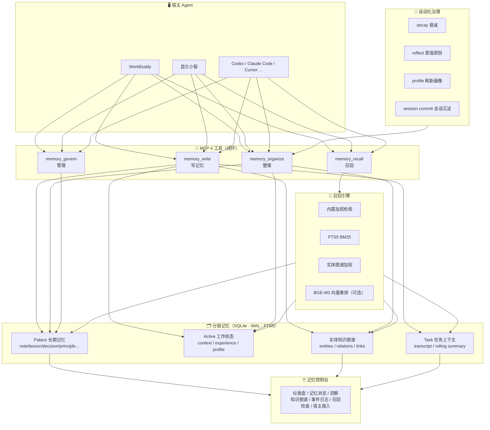

# 🍃 LeafMem

> 面向 AI Agent 的分层长期记忆引擎 —— 让 Agent 写得下、理得清、召得回，最终用记忆高效完成任务。

<p align="center">
  
  
  
</p>

LeafMem 不是一张记忆表，也不是一份滚动摘要。它把**长期记忆、工作状态、任务上下文、实体图谱**分层保存，再在 Agent 需要时组合召回。整套系统服务于一个闭环：

> **Agent 写记忆 → Agent 整理记忆 → 人 + Agent 共同管理 → 召回记忆指导任务**

---

## 📖 目录

1. [系统介绍](#-一系统介绍) —— 架构、四大 MCP 工具、分层记忆、自动化任务、纪律文件
2. [安装与升级](#-二安装与升级) —— 引导你的 Agent 完成安装 / 升级
3. [使用说明](#-三使用说明) —— 用户怎么用、Agent 怎么用
4. [基准测试](#-基准测试)
5. [文档索引](#-文档索引)

---

## 🧭 一、系统介绍

### 1.1 整体架构



**设计要点**：写入可控、召回可解释、跨 Agent 共享时仍保留来源与标记，而不是把所有上下文揉成一团。

### 1.2 四大 MCP 工具（闭环）

LeafMem 把记忆操作收敛为**四个面向闭环环节**的工具，每个工具内部再按 `action` 细分：

| 工具 | 环节 | action | 说明 |
|------|------|--------|------|
| `memory_write` | ✍️ 写记忆 | `remember` / `commit` / `task_append` / `active_distill` | 写入记录、提交会话沉淀、追加任务条目、蒸馏 active |
| `memory_recall` | 🔎 召回 | `recall` / `search` / `get` / `list` / `task_window` / `active_get` | 组装召回上下文、检索、读单条/列表、任务窗口、读 active |
| `memory_organize` | 🧹 整理 | `prepare` / `apply` / `reflect` / `profile` / `decay` / `calibrate` / `rebuild` | 维护、蒸馏原则、刷新画像、衰减、experience 校准重建 |
| `memory_govern` | 👥 管理 | `update` / `delete` / `attribute` / `pin` | 更新/删除记录、归因召回价值、固定防衰减 |

> 💡 这四个工具就是 Agent 与 LeafMem 交互的全部入口。安装器会把使用纪律注入宿主的指令文件，Agent 读到后就知道何时调用。

**工具背后的子组件**（每个工具由它们协同完成）：

| 子组件 | 作用 | 参与的工具 |
|--------|------|-----------|
| Proposal Extractor | 从对话/会话蒸馏出"值得记住"的提案 | write（commit） |
| Entity Extractor + Entity Store | 抽取实体（人/项目/技术/工具/组织）、建实体间关系与实体-记忆链接，构成知识图谱 | write（remember/commit 时自动建链）、recall（图谱加权） |
| Active Memory Manager | 维护 context / experience / **profile（用户画像）** 三类压缩文档；**profile 会注入每次召回** | recall（active 层）、organize（profile/distill） |
| Task Context Manager | 任务 transcript、rolling summary、决策窗口 | write（task_append）、recall（task_window） |
| Maintenance Manager | reflect（蒸馏原则）、calibrate/rebuild（experience）、attribute（归因） | organize、govern |
| Inspect Event Store | 写/改/删/召回的持久化审计事件 | 全部（自动） |

### 1.3 分层记忆模型

| 层 | 内容 | 特征 |
|----|------|------|
| **Palace** 长期记忆 | 持久记录，带 `scope`/`kind`/`source`/`tags`/`confidence`/`importance`/`metadata` | 可跨 Agent 共享，保留来源与标记 |
| **Active** 工作状态 | `context`（当前上下文）/ `experience`（可复用经验）/ `profile`（用户画像） | 压缩、随治理更新 |
| **Task** 任务上下文 | transcript 条目、rolling summary、决策 | 按 taskId 聚合 |
| **实体图谱** | `entities` / `entity_relations` / `entity_links` | 支撑召回加权与控制台可视化 |

**Scope 体系**：`user` / `task` / `agent` / `session` / `document` / `project` / `repo` —— 决定一条记忆对谁可见。

### 1.4 召回引擎

`memory_recall(action=recall)` 组装的是**四层上下文**：

1. **active 层** —— 用户画像 + 当前 context + experience（画像已注入，保证蒸馏知识真正参与）
2. **navigation 层** —— 命中的记忆导航
3. **task 层** —— 任务窗口（如有 taskId）
4. **palace/retrieval 层** —— 加权检索结果

加权信号：**词法重叠 + hash 向量 + 实体图谱加权 + FTS5 BM25 + recency + importance + principle 加成**，过期记录自动降权。**BGE-M3 向量重排为推荐默认配置**（安装引导默认开启，免费硅基流动额度即可），开启后 LongMemEval R@10 从 94.6% 提升到 97.6%。

**Inferencer（可选但推荐）**：DeepSeek 等 OpenAI 兼容模型，驱动三类高阶能力——reflect 蒸馏原则、profile 画像刷新、session commit 的深度治理。未配置时这些动作降级为本地确定性逻辑（不蒸馏），核心召回不受影响。

### 1.5 常规自动化任务

安装后建议配置这些周期性治理任务（宿主内 automation）：

| 任务 | 频率 | 作用 |
|------|------|------|
| `decay` 衰减 | 每周 | 陈旧且未被召回的低重要性记忆降权（不删除，pinned 豁免） |
| `reflect` 蒸馏原则 | 每周 | 同标签 lesson/decision 聚类蒸馏为 `principle` |
| `profile` 刷新画像 | 每周 | 基于 preference/identity 记忆 delta 更新用户画像 |
| session `commit` 会话沉淀 | 每次会话收尾 | 宿主蒸馏的 rollingSummary 落库，触发治理 |

> ⚠️ 这些整理动作**必须被真正触发**才有价值。LeafMem 的每周健康检查任务已内置 `decay → reflect → profile` 三连，避免"画像建了却从不召回、原则蒸馏了却不更新"的死结。

### 1.6 嵌入纪律文件

安装器会向宿主写入记忆使用纪律（recall-first、写入规范、scope 铁律等）。对 WorkBuddy 系宿主，纪律会投影到：

- `SOUL.md` —— 记忆工作流纪律（recall 前置、write 时机、commit 收尾）
- `MEMORY.md` —— 长期记忆摘要
- `USER.md` / `IDENTITY.md` / `AGENTS.md` —— 用户画像与身份

> 🔒 **纪律铁律**：写入时 `importance`/`confidence` 必须是数字而非字符串；`tags` 是扁平数组。违反会被拒收。

---

## 🚀 二、安装与升级

LeafMem 的安装/升级**优先由你的 Agent 引导完成**——你只需要对 Agent 说一句话，它会引导你配置 API Key、选择双宿主拓扑、并完成 MCP 接入。

### 2.1 通过 Agent 安装（推荐）

直接对你的 Agent（WorkBuddy / 昆仑小智）说：

> **“帮我安装 LeafMem 记忆引擎，并接入当前宿主。”**

Agent 会依次引导你：

1. **确认 Node.js 版本**（`>= 22.13.0`）
2. **安装依赖** —— `npm install @xdragonjia/leafmem` 或从源码构建
3. **选择双宿主记忆拓扑** ——
   - `shared`（推荐）：WorkBuddy 与昆仑小智共用同一记忆池 `agent:workbuddy`
   - `isolated`：各宿主独立记忆
4. **配置 API Key** —— 免费的硅基流动 BGE-M3 向量化（可选）+ DeepSeek inferencer（可选）
5. **写入宿主 MCP 配置 + 注入使用纪律**
6. **信任 MCP** —— 安装后需要在宿主 MCP 管理页点击「信任」激活

### 2.2 命令行安装

```bash
# 全局安装到所有支持的宿主
node dist/bin/leafmem-agent.js install all

# 单宿主
node dist/bin/leafmem-agent.js install workbuddy
node dist/bin/leafmem-agent.js install kunlunxiaozhi

# 指定记忆拓扑
node dist/bin/leafmem-agent.js install kunlunxiaozhi --memory shared
```

支持的宿主：

```text
workbuddy | kunlunxiaozhi | codex | claude | cursor | copilot | antigravity | trae | all
```

所有宿主默认指向同一个 SQLite：`~/.leafmem/memory.sqlite`

### 2.3 通过 Agent 升级（推荐）

对 Agent 说：

> **“帮我升级 LeafMem 到最新版本。”**

Agent 会拉取最新代码、重建、刷新各宿主的 MCP 配置与纪律注入。若工具接口变更，Agent 会提醒你**重新到 MCP 管理页点信任**。

### 2.4 命令行升级

```bash
node dist/bin/leafmem-agent.js update all
```

### 2.5 控制台与本地服务

```bash
# 启动浏览器控制台
node dist/bin/leafmem-agent.js ui

# 管理常驻服务
node dist/bin/leafmem-agent.js service install
node dist/bin/leafmem-agent.js service status
node dist/bin/leafmem-agent.js service url

# 终端版
node dist/bin/leafmem-agent.js tui
```

### 2.6 API Key 快速上手

LeafMem 开箱即用（本地内置检索即可工作）。**推荐默认配置**（安装引导会默认帮你配好）：

- **向量化 + 重排**：硅基流动 BGE-M3（免费额度，显著提升召回精度，默认开启）
- **inferencer**：DeepSeek 或任意 OpenAI 兼容模型（驱动 reflect/profile 等蒸馏能力）

配置细节见 [`docs/GETTING_STARTED.md`](docs/GETTING_STARTED.md)。

---

## 📚 三、使用说明

LeafMem 的使用分两类场景：**用户日常触发** 与 **Agent 自主使用**。

### 3.1 用户怎么用

你不需要记命令，只需在对话里用自然语言触发：

| 你想做什么 | 对 Agent 说 | Agent 实际调用 |
|-----------|------------|---------------|
| 让它记住一件事 | “记住：以后先给结论再给证据” | `memory_write(action=remember)` |
| 回忆之前的决定 | “我们之前是怎么定 X 方案的？” | `memory_recall(action=recall)` |
| 改一条记忆 | “把那条偏好改成简洁英文回复” | `memory_govern(action=update)` |
| 删一条记忆 | “删掉那条过时的记录” | `memory_govern(action=delete)` |
| 保护重要记忆 | “把这条原则固定住，别被衰减” | `memory_govern(action=pin)` |
| 主动整理 | “整理一下最近的记忆” | `memory_organize(action=reflect/profile/decay)` |
| 看任务工作态 | “这个任务之前做到哪了？” | `memory_recall(action=task_window)` 或控制台任务页 |

#### 记忆控制台

打开 `http://127.0.0.1:3377/console`（或 `leafmem-agent ui`），功能：

| 页面 | 作用 |
|------|------|
| 📊 仪表盘 | 记忆总数、蒸馏原则、召回次数、类型/来源分布、最近活动 |
| 📖 记忆浏览 | 检索、筛选（类型/来源/标签）、查看、删除记录 |
| 💡 洞察 | 蒸馏原则列表、用户画像 |
| 🕸️ 知识图谱 | 实体关系力导向图（预模拟稳定布局、邻接高亮、点击详情） |
| ⏱️ 事件日志 | 写/改/删/召回的审计流水 |
| 🔎 召回检查 | 模拟 Agent 检索，看实际召回了什么 |
| 📋 任务上下文 | Agent 工作态（transcript + rolling summary），分页浏览、点开看详情；与记忆是两套数据 |
| 🔌 宿主接入 | 各宿主安装状态、MCP/纪律/session 导入 |
| ❓ 帮助文档 | 本文档，支持目录跳转与全文搜索（mermaid 图实时渲染） |

### 3.2 Agent 怎么用

安装器已把纪律注入宿主，Agent 按以下闭环自主运行：

#### ① 写记忆（`memory_write`）

- **recall-first**：回答前先 `memory_recall(action=recall)`，除非请求完全自包含
- **remember**：用户表达持久偏好/工作规则 → `memory_write(action=remember)`，可省略 scope（默认落当前宿主）
- **commit**：重要工作完成或会话收尾 → 宿主先用自己的模型蒸馏 `rollingSummary`，再 `memory_write(action=commit)`，并附带 `activeContext`/`activeExperience`

#### ② 整理记忆（`memory_organize`）

| action | 作用 |
|--------|------|
| `reflect` | 同标签 lesson/decision 聚类蒸馏为 `principle`（节流，内部判断到期） |
| `profile` | 基于 preference/identity delta 更新用户画像（只改 LLM 输出的 section） |
| `decay` | 陈旧未召回的低重要性记忆降权（pinned 豁免，不删除） |
| `prepare` / `apply` | 宿主中介式 active 维护：prepare 生成请求，apply 落库 |
| `calibrate` / `rebuild` | experience 校准 / 重建 |

#### ③ 管理记忆（`memory_govern`）

- `update` / `delete`：用户要求修正或删除时（需显式 scope）
- `attribute`：某条被召回的记忆**真的指导了工作**后，归因加权
- `pin`：固定重要记忆防衰减

#### ④ 召回（`memory_recall`）

- 组装 active + navigation + task + palace 四层上下文（active 层含用户画像）
- `search` / `get` / `list` 返回完整记录；`recall` 返回 prompt-ready 文本（record 内容已并入 injectedContext）

#### ⑤ 实体图谱与审计（自动，无需手动调用）

- 每次 `remember`/`commit` 自动抽取实体并建链，召回时图谱参与加权；控制台"知识图谱"页可视化
- 每次写/改/删/召回自动写审计事件，控制台"事件日志"页可查

### 3.3 纪律文件使用约定

- **scope 铁律**：默认 scope 由 mcp.json 注入（如 `agent:workbuddy`），写入时不传 scope；必须指定时用当前宿主 scope
- **召回省略 scope**：跨 Agent 召回共享记忆时不传 scope，让 LeafMem 搜共享池
- **参数类型**：`importance`/`confidence` 是数字；`tags` 是扁平数组（XML 逐项）

---

## 📈 基准测试

在 2026-08-08 于本代码库重测（内置确定性；BGE-M3 重排走硅基流动向量化）。完整方法与复现见 [`benchmarks/BENCHMARKS.md`](benchmarks/BENCHMARKS.md)。

| Benchmark | 模式 | R@5 | R@10 | NDCG@10 | 需 LLM |
|-----------|------|-----|------|---------|--------|
| LongMemEval (500q) | 内置，零依赖 | 89.6% | 94.6% | 0.834 | 否 |
| LongMemEval (500q) | + BGE-M3 重排 | 95.8% | 97.6% | 0.916 | 否 |
| LoCoMo (1986q) | 内置，零依赖 | 84.1% | 92.0% | 0.733 | 否 |
| LoCoMo (1986q) | + BGE-M3 重排 | 88.4% | 94.9% | 0.790 | 否 |

---

## 📂 文档索引

| 文档 | 内容 |
|------|------|
| [`docs/GETTING_STARTED.md`](docs/GETTING_STARTED.md) | API Key 配置、双宿主数据策略 |
| [`docs/USAGE.md`](docs/USAGE.md) | MCP、宿主接入、UI/TUI、导入、存储 |
| [`docs/WORKBUDDY.md`](docs/WORKBUDDY.md) | WorkBuddy 最短接入路径 |
| [`docs/ARCHITECTURE.md`](docs/ARCHITECTURE.md) | 分层设计、召回流、SQLite schema |
| [`docs/API.md`](docs/API.md) | 核心 API、4 工具、HTTP 路由 |
| [`benchmarks/BENCHMARKS.md`](benchmarks/BENCHMARKS.md) | 基准方法与完整结果 |

---

## 📦 包入口

```text
@xdragonjia/leafmem            # 主入口
@xdragonjia/leafmem/core       # 分层记忆核心
@xdragonjia/leafmem/mcp        # 4 工具 + stdio MCP server
@xdragonjia/leafmem/active     # Active 记忆（context/experience/profile）
@xdragonjia/leafmem/task       # 任务上下文
@xdragonjia/leafmem/entity     # 实体图谱
@xdragonjia/leafmem/retrieval  # 检索（内置/向量/QMD）
@xdragonjia/leafmem/maintenance# 治理（decay/reflect/profile）
@xdragonjia/leafmem/runtime    # 召回上下文组装
@xdragonjia/leafmem/http       # 控制台 HTTP
@xdragonjia/leafmem/adapters   # Hermes/OpenClaw 兼容
```

---

## ⚠️ 能力边界（如实说明）

- **零外部依赖即可运行**：不配任何 API Key 也能召回，只是精度低于开启 BGE-M3 重排的版本（见基准表）
- **蒸馏类能力依赖 inferencer**：reflect/profile/深度治理未配置模型时降级为本地逻辑，不做 LLM 蒸馏
- **超大存储**：数万条以上建议开启向量重排或检索后端扩展，内置加权检索在千级规模表现最佳
- **Markdown 宿主桥接为单向**：首次导入后以 SQLite 为准，markdown 仅作展示镜像

---

## 🔒 许可

专有许可（Proprietary）。LeafMem 当前以私有许可分发，详见 [`LICENSE`](./LICENSE)。

<p align="center"><sub>🍃 LeafMem · Layered long-term memory for AI agents</sub></p>
