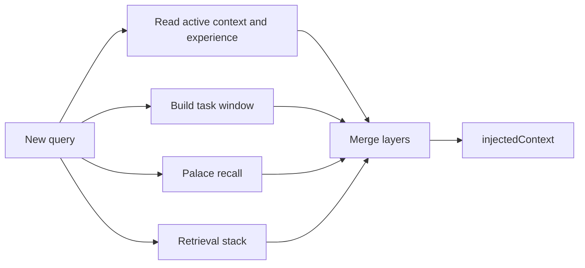
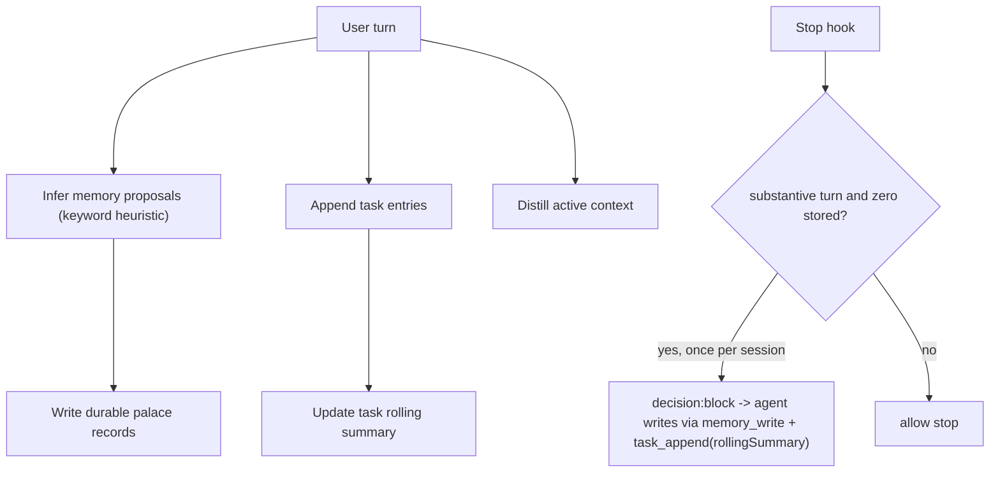

# LeafMem Architecture

LeafMem is a layered memory subsystem for AI agents. It keeps durable records, compressed working state, and task-local context separate, then composes them at recall time.

## Layers

| Layer | Purpose | Stored as |
|-------|---------|-----------|
| 长期记忆（Palace） | Durable long-term memory records | `memory_items` |
| Active memory | Compressed current context and reusable experience | `active_documents` |
| Task context | Per-task transcript entries, rolling summary, and decisions | `task_context*` tables |
| Retrieval | Optional vector / QMD retrieval on top of palace records | built-in scoring, vector store, or QMD |

## Module Structure

```text
src/
├── core/              Palace CRUD, search, recall, dedup, storage
│   ├── memory.ts      LeafMem class
│   ├── storage.ts     SqliteMemoryStore + InMemoryStore
│   ├── types.ts       MemoryRecord, MemoryScope, MemoryStore
│   ├── hash-embedding.ts
│   └── tokenize.ts
├── active/            Active context + experience distillation
├── task/              Task entries, summary, decisions, prompt windows
├── retrieval/         Builtin retrieval, remote embedding rerank, QMD
├── maintenance/       Experience attribution, calibration, rebuild
├── runtime/           Turn capture and layered recall orchestration
├── mcp/               JSON-RPC tool handler and stdio server
├── adapters/          Generic, Hermes, OpenClaw, and WorkBuddy adapters
├── bridge/            Markdown projection bridge adapters
├── platform/          Project-aware service boundary
├── http/              Local HTTP API and console routes
├── auth/              Local project API key support
├── inspect/           Event log, recall inspection, webhook dispatch
├── agents/            Local multi-agent setup manager
├── console/           Browser control plane
└── bin/               CLI entrypoints
```

## Layered Recall Flow



The recall result can expose both prompt-ready text and structured hits. MCP `memory_recall` with `action: "recall"` keeps the full `hits[].record`, including `source`, `tags`, and `metadata`.

## Turn Capture Flow



Two capture paths coexist (2026-08-11):
- **Heuristic path**: the Stop bridge POSTs the turn to `/v1/turns/capture`; a keyword
  rule extractor (remember/preference/decision/identity phrasings) stores matches.
  Free, no LLM, but blind to complex work turns.
- **Agent-driven path**: when the session did substantive work (user+assistant
  >= 15 chars) yet nothing was stored, the Stop hook returns
  `{"decision":"block"}` with an instruction, pulling the agent back to write
  durable memories and task context itself. Loop guards: (1) host
  `stop_hook_active` flag never blocks twice; (2) `~/.leafmem/capture-state.json`
  allows at most one drive per session; (3) stored>0 or trivial sessions pass.
  Disable with `LEAFMEM_HOOK_STOP_DRIVE=0`.

`task_append` accepts an optional `rollingSummary` (2026-08-11) so tasks created
purely via appends are not left "transcript without summary" on the console.

### Task Lifecycle

Tasks are born `active` and **never close themselves** — there is no timeout or
auto-archive. The only transitions are explicit: `memory_write(action=task_append)`
accepts an optional `status` (active/paused/completed/archived) and
`TaskContextManager.setStatus()` flips it programmatically. The Stop-drive
instruction tells the agent to pass `status="completed"` when the tracked work
is finished — and to rewrite `rollingSummary` to a closed-out version in the
same call (a completed badge next to stale "pending" text misleads more than a
missing summary). This was hardened after a real incident (2026-08-11) where the
status enum existed in types but no write path exposed it, leaving every
task_append-created task permanently "active" on the console.

## SQLite Schema

Default local MCP storage path: `~/.leafmem/memory.sqlite`

| Table | Purpose |
|-------|---------|
| `memory_items` | Palace records with scope, kind, content, summary, confidence, importance, source, tags, metadata, timestamps |
| `memory_items_fts` | FTS5 full-text index for palace records |
| `active_documents` | Active `context` and `experience` documents by scope |
| `task_context` | Task metadata |
| `task_context_entries` | Ordered task transcript entries |
| `task_context_state` | Rolling summary per task |
| `task_context_bookmarks` | Decisions and task bookmarks |
| `entities` | Lightweight entity records |
| `entity_links` | Entity to memory links |
| `entity_relations` | Entity graph edges |

The schema is created automatically on first connection. SQLite runs with WAL mode and foreign keys enabled.

### Time Convention (2026-08-12)

- **Storage & API**: all timestamps are ISO 8601 UTC strings (`...Z`), in every
  table. Task-family tables were migrated from epoch-ms INTEGER by
  `migrateTaskTimestampsToIso` (runs on every open, idempotent); readers also
  normalize legacy integers defensively.
- **Console display**: all rendering converts to Asia/Shanghai (Beijing time)
  via `Intl.DateTimeFormat` with explicit `timeZone`, never the browser's local
  zone and never raw UTC strings. One set of fmtDate/fmtTime/fmtDateTime
  helpers is the single display entry point.

## Scope Model

Memory records are scoped so recall can merge broad and narrow context without mixing unrelated projects.

Supported scope types:

```text
agent | session | user | task | document | project | repo
```

For project-aware platform usage, repo scope is project-qualified internally. For agent setup, LeafMem intentionally keeps MCP recall broad by default so agents can share one user memory store, while durable writes can still use `agent:<id>` scopes.

Scope resolution rules (`resolveContextScopes`, hardened 2026-08-11 after a real incident where explicit writes landed in a session-local `proj_local_*` scope):

- An explicit scope selection (`anyScope`, e.g. from body/query `scope=agent:workbuddy`) targets **both** recall and writes — never recall-only with writes silently falling back to the session project scope.
- `allScopes` (console "全部记忆") resolves to an empty recall-scope list, meaning "search the whole library". It must not collapse to the session project scope.
- `POST /v1/memories` honours a top-level body `scope` field (precedence: body.scope > body.context.scope > URL ?scope). Previously only the query param worked and body scope was silently dropped.

### Initial Import: LLM-mediated distillation

The six-file installer import is no longer mechanical line-sharding (which produced 300+ fragments: dividers, orphan headings, split list items). The installer records a pending-distillation state; the host agent distills each file into 1-4 paragraph-unit memories (INSTALL guide step 7.5). `parseMarkdownEntries` remains only as a legacy safety net: structural dividers and orphan headings are never imported alone, nested bullets merge into their parent, and the single-machine store no longer masks credentials.

## Storage Boundaries

- Builtin palace search loads scoped records into memory for scoring. It is intended for small to medium local stores.
- Larger collections should use the retrieval stack with remote embeddings or QMD.
- Active memory is stored in SQLite. Markdown bridge adapters mirror durable memory files for host compatibility.
- Generic adapters stay thin. Host-specific wrappers should reuse the host's model/provider/auth where possible.
